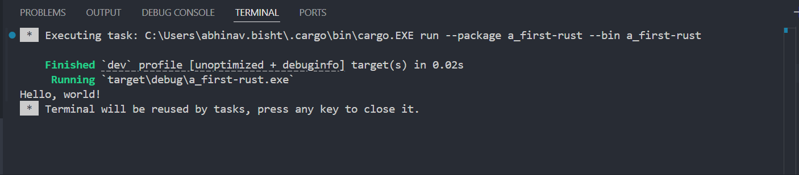
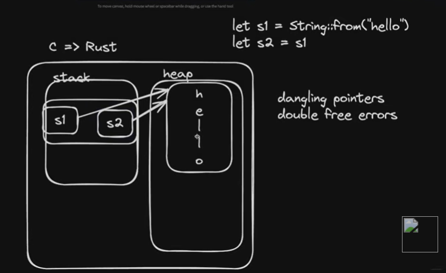
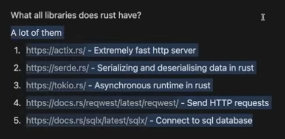

### RUST

type-safe, systems language(runs very close to your machine), very fast(eg web rtc implementations)(eg media soup uses js apis to talk to a rust or C `worker), seperate compilation steps(code->compiles to->binary(runs really fast))(js python does this together), lets you spawn threads(each thread can indivisually run on one of the cores)(node=single threaded to multi-core IPC or inter process communication, while java rust go are multi threaded), memory safe(not like malloc and calloc)

cargo is the package manager for rust
cargo.toml similar to package.json

creating project:
- cargo init (initializes end user app)
- cargo init --lib (cant be run independently, other projects can use it)

running using vs code build the binary and runs in single step:

## Memory management in rust!
SSD, RAM(imp + fast), C gives direct access to ram(may cause dangling pointers, your code may read some other memory data), in js garbage collector(good), the rust way: ownership model(rules on top of C, memory safe), rules(without following which the code wont compile): garbage collection takes time, thus rust is really fast! it is achieved using:

- mutability
- heap and stack
- ownership model
- borrowing referneces
- lifetimes

# Mutability
by default all var in rust are immutable, values cant be changed once assigned, helps when say, mutable, and 2 threads are trying to access the same var, thus preventing the race conditions(immutable data is inherentl thread safe, and no synchronization is needed, also compiler doesn't need to wait to accomadate checks for race conditions)(in js we sometimes use, immutable collections for java script)

# Stack vs Heap
rust has rules for stack(structured) and heap(disorganized) data management, as fixed sized data can be placed with the adequate size in the stack but as the size of variable sized types(vectors) can chage during runtime they need to be placed in a more free memory(need to ask os for heap space). 

The stack has fast alocation and deallocation. The vars are not pused one by one,say when we call a function we push a stack frame containing multiple variables of that function. if 2 functions one calling the other, 1st the caller gets pushed then on call the calling gets pushed.

The reference to the var in heaps 1st point of reference is stored inside the stack frame along with the length and capacity! if size of var increases more bits are requested from to the stack. The length and capacity are different as they are stored and updated seperately based on of you are increasing the appending something to the string, length=how much space it takes, capacity=how much space its allowed to take! Updating/appending for quite sometime the pointer value doesn't change but if the string hits a wall that it can no longer extend on the same pointer ie have something else stored at further locations, the pointer cahnges to a new position that can accomadate our string

# Ownership
A system with a set of rules that the compiler checks for to manage memory this causes rust compilation to be really slow.

Not complicated for stack, heap variables(are like rihana..personal understanding), heap variables always want to have an owner and a single owner and if the owner goes out of scope, the variable gets deallocated.

Anytime you put something on the heap, there will be some variable on the stack that will own it. If the owner is changed the pervious owner becomes invalid.

the scenario in the above image is not possible as s1 will be invalidated(kill itself) 

As copying is expensive on a heap, in rust if s2=s2, both point to the same variable, this may cause issue when we are passing vars across functions, thus we may pass s1.copy(), or return the value from the called function to the calling function in a variable, this will keep the data in heap alive, the validity of the var depends on what var recieves the return!

# Borrowing and References
This concept allows our heap data(rihana) to be borrowed from time to time, temperorily and defines the rules applied to it:

- you can borrow a variable if you want the owner to be retained(passed by reference), but the data only dies of the owner dies, borrowers dying makes no affect. insted of s2=s1, we s2=&s1, similarly we can temperorily transfer ownership by making function calls like takes_ownership(&string), recieving also in &String. 

The heap data/var can have only multiple immutable borrowers(cant change the value, i.e. no hanky-panky)

- if you want your function to modify the var i.e. mutable reference, you need to s2=&mut s1 or pass &mut s1 to the calling function! function takes type &mut String. When you create this mutable reference, you can no longer create any mutable or immutable reference.

Sometimes if you leave a reference unused, you may observe that even though you are taking refernces after an immutable refenrce the rust compiler throws no error as its smart enough to understand that if that refernce created is being used or not.

These rules help you keep the data consistent and prevent race conditions

# Structs
Used to create objects, like types in TS. Apart from these normal ones other types of structs are unit structs and tuple structs, unit structs basically without attributes used like classes without attributes and tuple structs are basically tuples with named struct.

you can also implement structs, i.e. attatching functions to the instance of structs(like classes), also created 

# Enum
Used when one out of a list of values need to be selected. Some of the commonly used enums are error handling and optional type.

Instead of JS try{}catch{}, rust uses result enums(to be declared and be returned by a function that might throw that error) for graceful error handling.

If there is a function that can error out or stop a thread, the fuction can prevent doing those by returning a result of type error.

There is another enum called the option enum which is used to handl the concept of nullability, safely. So if something can be either a value or null we use options enum. Option<i32> and then match in the main!

# Cargo
package manager for rust to import package,

cargo add ...

use from this::{these};
eg, use rand::{Rng, thread_rng};

Lefovers: traits, generics, lifetimes, multithreading, macros, async ops