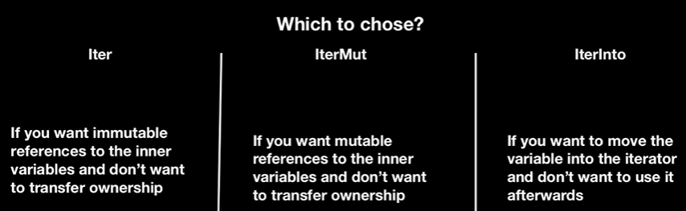

# RUST

2 types of project in rust, binaries(cargo init)(backend of website, for end user) and liabraries(cargo init --lib)(to be used like express)

options enum: allow to return none/null/nill, biscally gives the function the ability to return some value or null.

```
pub enum Option<T>{
    None,
    Some(T),
}
```


result enum: for error handlin gfunction returns a result enum, which may return a desired output or an error


package management:
import => cargo add <crate_name>

eg chrono for date and time


## Collections

Set of useful data structures, collections can contain multiple values, the data is stored in the heap.

### Vectors
Dynamic array, puts values next to each other in memory

### Hashmap
Help store key value pairs on rust

### iterators in rust
allows you to perform some tasks on a sequence of items, responsible for iterating over each item and determining when seq is finished. Iterators are lazy they dont take effect until you call methods that consume them!

if vals is a vector, when we are writing: for v in vals it is under the hood gettinig converted to: for v in vals.iter(), the iterator doesn't consume the values just borrows them so no issue for ownership. This borrowed reference may be immuatble or mutable. Iterator also has its .next() function to iterate!

There is a 3rd type of iterator called the into-iterator, can give some performance benefits, it converts collection into an iterator by taking the ownership of it. Used when a)the original collection is no longer required, b)when we need to seque

normal iter is a collection of references while the intoiter contains actual values(saves some time). All this info would be more useful when you are implementing a iterator traits.



Iters also provide you some functions by default.

The ones you can access on top of iterators eg iter.sum() are "consuming adapters". Once consumed(taken ownership of) you can't use it again.

The iterator adaptors are the ones that dont consume the iterator but produce diff iterators by changing some aspects of the original. Eg iter.map(|x| x+1);

iterator back to a vector: a=iter.collect()


# String vs Slices

the string from std library is growable mutable, owned and utf-8 encoded. As studied earlier in stack: ptr, len and capacity while in heap: the actual string if append something, till capacity the size increases else the entire content is placed someplace else!

slices let you refer a contiguous sequence of elements in a collection rather than whole collection, its a type of teference so doesn't have ownership.String slices are a type of these and utf-8 encoded.

Same slicing implementation works for things other than strings


# Generics

need to add:  <T:std::cmp::PartialOrd>
the only thing rust gives extra is the bound that checks if the operators used in the function are compatible with the type


# Traits

Like abstract classes in java, interfaces in js. Define the functionality of a type that can be shared with other types. Used to define shared behaviour in an abstract way. Trait bounds used to specify that a generic type can be any type that has certain behaviour.

say a trait summary{ fn xyz(&str)->String;}, now any stuct say "User" that implements this trait must have any function defined inside that trait, eg here xyz!

we mean a seperate:

impl xyz for User{..should have that function defined..}

then any user/instance of user can use the function defined in that trait.


Also while initally defining the function inside a trait we can also have a default implementation that would be used if the struct implementing that trait doesn't have that function defined.

We can also setup a function such that it takes only those structs as a parameter that implement a particular trait

The impl Trait or a.trait_fun() are syntactical sugar for trait bounds, eg:

```
fn notify<T: Summary + F1>(item: T){  
    println("breaking news! {}", item.summarise());
}
```

where Summary is the trait and summarise is the function defined in the trait. Generic with the constraints on the generic. For multiple traits use '+'.


# Lifetimes (Hard)

```
fn main(){
    let ans;
    let str1=String::from("longer");
    {
        let str2=String::from("small");
        ans=longest(&str1, &str2);
    }
    println!("{}",ans);
}

fn longest(a:&str, b:&str)->&str{
    if a.len()>b.len(){
        return a;
    }else{
        return b;
    }
}

```

Would not compile as if the str2 is returned, its scope will finish after the defined block thus causing a 'dangling reference/pointer' and rust wants to prevent this.

We need to be cautious that how the lifetime of what is returned by a function relates to the parameters used for that function, say lifetimes of a span foor '8' lines and that of b spans for '4' lines and the return types are using references, then ans would be valid for the shorter if the 2 lifetimes(intersection of the 1st and 2nd one).

To solve this we use a 'generic lifetime parameter',

```
fn longest<'a>(a: &'a str, b: &'a str)->&'a str{
    if a.len()>b.len(){
        a
    }else{
        b
    }
}
```

baically we define a generic 'a such that 'a demonstrate the lifetime of that var or reference. it reperesent that the 2 vars have certain lifetimes and the returned valuse is alive for the intersetion of the 2 lifetimes(shorter of the two). So still error but better error, str2 doesn't live long enough.


# Structs with lifetimes

```
struct User<'a>{
    name: &'a str,
}

fn main(){
    let user;
    {
        let name=String::from("abhinav");
        user=User{name: &name};
    }
    println!("{}",user.name);
}
```

a struct cannot contain referneces inside it till the lifetime of the struct and the lifetime of the referneces has been tied together, thus making it so that eg, the existance of the user should also be tied to the existance of the title, thus we can not have a user(struct) without a title(contained ref) and also if the title(ref) is dropped then the user will also be dropped too.

Eg in the above code though the user should have survived till the println but doesn't as the name reference no longer exists causing the struct to also be dropped.

A struct can have 2 lifetime referencesfor 2 seperate variables too!

```
struct User<'a, 'b>{
    first_name: &'a str,
    last_name: &'b str,  
}
```


if a struct implements the display trait then it can print like, println!("announce: {ann}")


# Multithreading

Similar to the multithreading/threadpools concept in java. On a modern machine with multiple cores, the OS runs the code in a process and the OS manages multiple of these processes at once. Within it a program also has independent parts that run simultaneously. The feature that run these independent parts is called a threads(so diff parts of a single process run on diff threads).

## Concurrency vs Parallelism

Concurrency is a programs ability to handle multiple tasks by interleaving their execution, independent and progress or stop over time, but both tasks dont run at the exact same instant. Mutiple logical threads of control share a single cpu core done using time slicing and volentary yielding. Good for IO bound workloads(as blackage/idele time). Hides latency.

Parallelism refers to truly sialtaneous execution, by multiple task running at same time on different cores or processors. Better for cpu bound tasks where performance is bound by computation itself rather than waiting. Increases throughput.

Concurrent programs can appear to run in parallel even when backed by single thread or core eg single threaded event loop in js can handle multiple io events concurrnetly(without parallel capability)

Task scheduling: premptive(schedular inturrepts running tasks after a time slice to give others a turn)(time sliced concurreny ensures responsiveness and fairness, thoug cost the kernel) and corperative(reies on voluntary yielding, would cause issue if the programmers forgets to yield, eg async await, here await is the yield) done by schedular.


```
let vvv=vec![1,2,3];
let handle=thread::spawn(||{
    println!("the vector is {:?}", vvv);
});
handle.join().unwrap();
```

the above code wont compile as v could go out of scope before the thread starts, me need to add/use move to move the ownership of v to that thread!

```
let vvv=vec![1,2,3];
let handle=thread::spawn(move||{
    println!("the vector is {:?}", vvv);
});
handle.join().unwrap();
```

you can also share reference by using scoped threads. For further clarification refer the multithreading part in the code.


# Message Passing
How messages/communication can be sent form one thread to the another safe concurrency! Eg one thread constantly reading data from redis and the other performing actions using it.

to implement this we use mpsc(multiple producers, single consumer) from sync in the standard liabrary

```
let (tx, rx)=mpsc::channel();
thread::spawn(move||{
    let val=String::from("hi");
    tx.send(val).unwrap();
});

let received=rx.recv().unwrap();
println("Received: {}", received);
```

We need to unwrap the .send() as the function return a reslut emum which will return an error if the channel is closed, otherwise where we receive we would have to pattern match.

using multiple receivers
```
let (tx,rx)=mcsr::channel();

for i 0..5{
    let producer=tx.clone();
    thread::spawn(move||{
        let mut ans: u64=0;
        for j in 0..100000{
            ans=ans+(i*1000000+j);
        }
        producer.send(ans).unwrap();
    });
}

let mut ans: u64=0;
for val in rx{
    println!("currnet status: {}",ans);
    ans=ans+val;
}
println!("Ans is {}", ans);
```